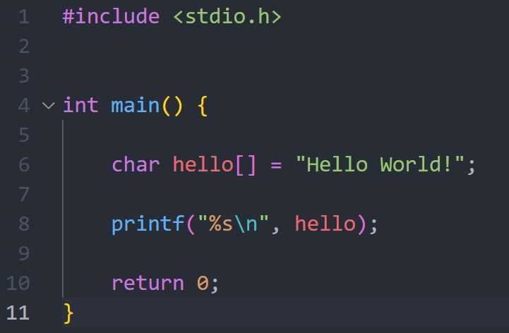
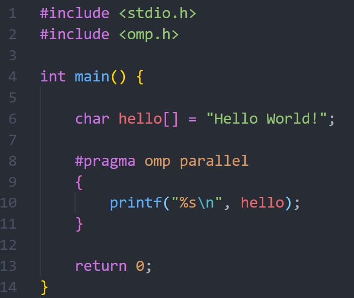
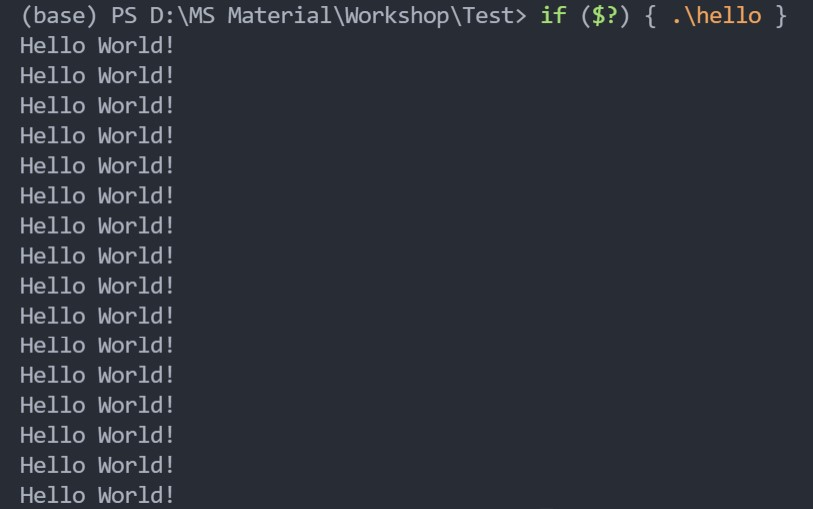
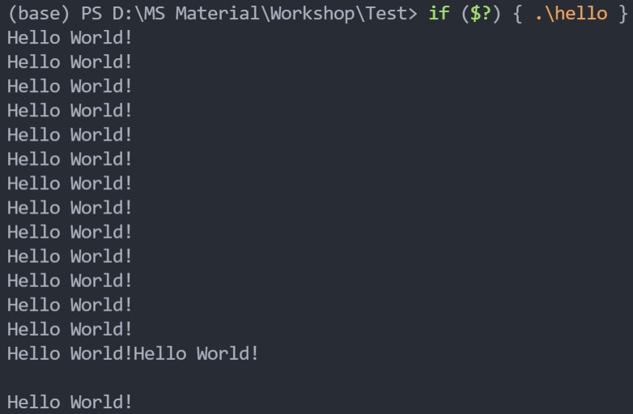

## Introduction

OpenMP is an API supporting shared memory parallel computing for C, C++, Fortran.

### Simple workflow for OpenMP

#### Parallel Hello World
Simple C code for hello world looks like:
<p align="center">

</p>

To parallel printing hello world, we just need to include omp header and wrap your code in omp parallel heading
```c
#pragma omp parallel
{
    // your parallel tasks here
}
```

The actual codes should look like:
<p align="center">

</p>

And outputs of the parallel hello world should be:
<p align="center">

</p>

Here my CPU processor has 16 threads, so there are 16 lines of `Hello World!` output in the terminal. Or if you wish to pre-define number of threads used in the job, you can define it before the parallel section.

```c
omp_set_num_threads(4);
#pragma omp parallel
{
    // your parallel tasks here
}
```

In the above sample, the number of threads is confined at 4. So there will be only 4 lines of `Hello World!` output.

If we write the parallel job as
```c
#pragma omp parallel
{
    printf("%s", hello);
    printf("\n");
}
```
Sometimes (not always) we will get output format as:
<p align="center">

</p>

where the output format does not seem correct. It's due to that different threads may have different running speed (even with the same specification). Here, there's one thread running slow, so the output linefeed sign `\n` comes later than the output `Hello World!` of another thread. This is actually the prove for parallel independency, where all threads run their tasks independently without interference with each other.

#### Task Parallelism

One of the frequently used parallel idea is task parallelism, where usually benefits if we intend to perform different tasks on the same tasks. In task parallelism, we can just assign different tasks to each thread, and improve the efficiency.

The structure for task parallelism using OpenMP is:

```c
#pragma omp parallel
{
    #pragma omp sections
    {
        #pragma omp section
        {
            // one parallel task
        }
        // ...
        #pragma omp section
        {
            // one parallel task
        }
    }
}
```

Every `#pragma omp section` corresponds to a task that will be assigned to a thread. All the sections will be running on individual threads.

The problems of task parallelism is that: (1) The threads that maximized the efficiency is defined by the tasks (if we define 3 parallel tasks, the efficiency will reach maximum when 3 threads are assigned; more threads will just wait the task to finish.) (2) The total time required for the job is defined by the slowest one parallel task (say three parallel tasks take 1s, 2s and 1day to finish, we will wait for at least 1day for the entire job; so if the task workloads are not balanced, we can not take the full advantages of parallelism).

#### Data Parallelism

Or, one other common solution for parallelism is data parallelism. Usually, this benefits if we intend to perform same tasks on large dataset. The idea is to divide the dataset to sections, where each thread is responsible for performing on one sections.

The structure of data parallelism using OpenMP is:

```c
#pragma omp parallel
{
    func(); // a function for parallelism
}

int func()
{
    #pragma omp for
    for (int i = 0; i < 100; i++)
    {
        // parallel tasks
    }
}
```

For N threads assigned, the above structure will divide the data memory to N sections (as equally as possible), and each thread will complete on assign task. Thus, the efficiency of entire tasks will be improved.

However, the limitation of this idea is that with more threads assigned, the computer will assign further threads (distant from data memory) to finish the task. This is limited by the nature of physical computer architecture design. Further threads will take longer time and more resources to exchange the data flow, thus, causing the efficiency drops. In reality, increase in threads will not infinitely increase the efficiency, but capped at some stage. Too many threads assigned will cause more resources wasted and not necessary for the job.
